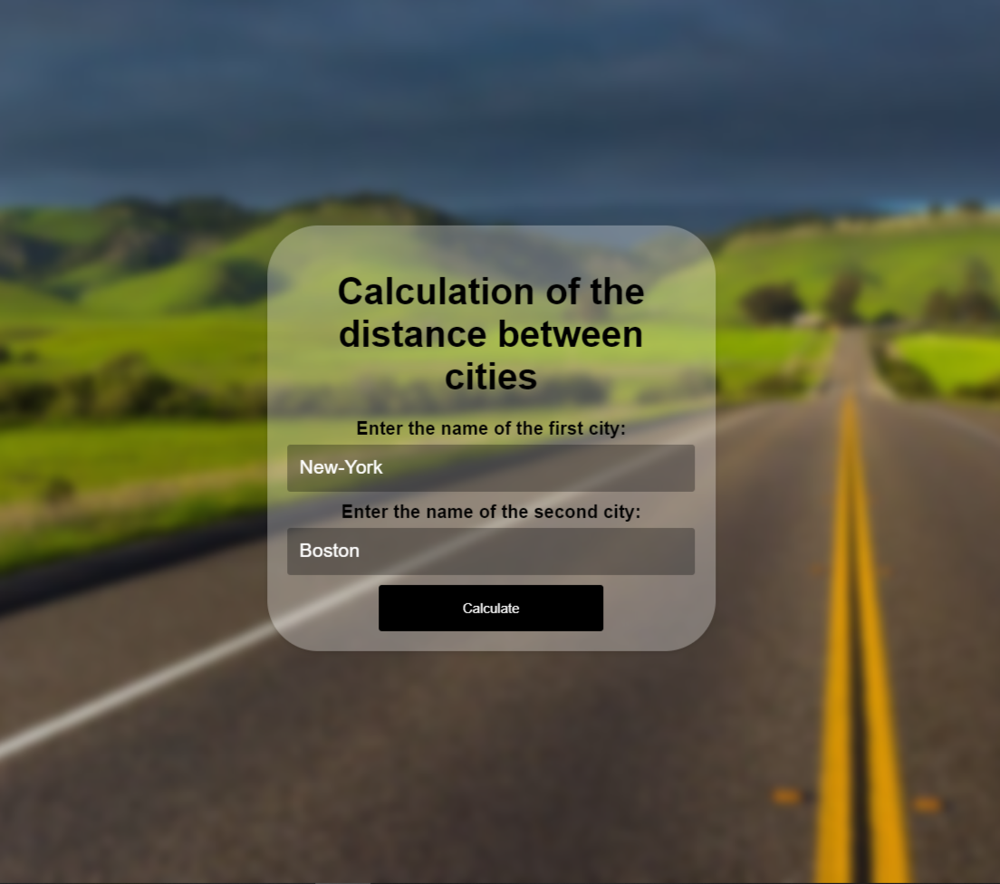
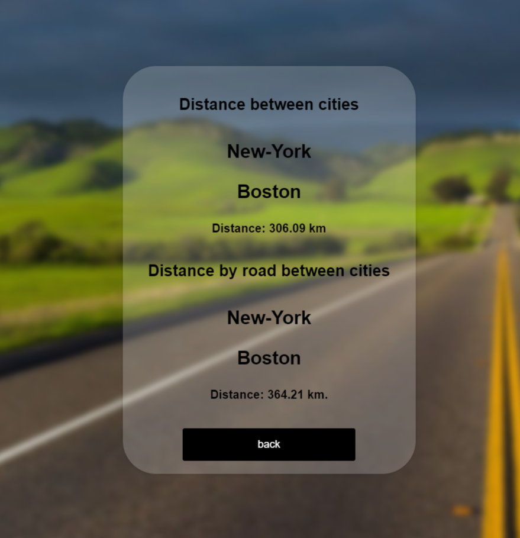

# Citi_Distance_Calculator

The project allows you to get the distance between 2 cities in a straight line and by road

## Project structure
### The project consists of the following parts
1. Applications:
 - `static` - Directory for storing static project objects;
 - `templates` - Directory for storing the necessary application templates;
 - `tests` - The package in which the unit-tests are located;
 - `env.template` - A template for creating a document .env in which personal data must be stored;
 - `distance_app.py` - A file containing the configuration and connection of the flask application;
 - `find_distance.py` - A file containing information about the distance between cities.
2. Documentation:
 - `ReadMe.md` - Project Description;
 - `requirements.txt` - Connecting dependencies;

## Project Installation
To install the source code of the online store, clone the repository from GitHub or enter the following command:
```
https://github.com/Khamer-Ivan/City_Distance_Calculator.git
```
In order for the project to work correctly, you need to install the dependencies using the command:
```
git install -r requirements.txt
```
You need to create a .env file and fill it in following the instructions in .env.template:
```
API_KEY="Your key received at https://openrouteservice.org/"
```
Now you can start the server by entering the command
```
python distance_app.py run
```

After starting the server, you will be taken to the first page, and you can start using the application



